# 2. Веб-клиент

Клиент открывается по адресу инстанса: локально — http://localhost:5173, в Docker —
http://localhost:8080. Все примеры ниже сняты на тестовом пространстве **Acme**: команда
**Инженерия** (`ENG`) с проектами «Мобильное приложение» и «Платёжный шлюз», команда **Дизайн**
(`DES`) и четыре человека.

## Вход и регистрация

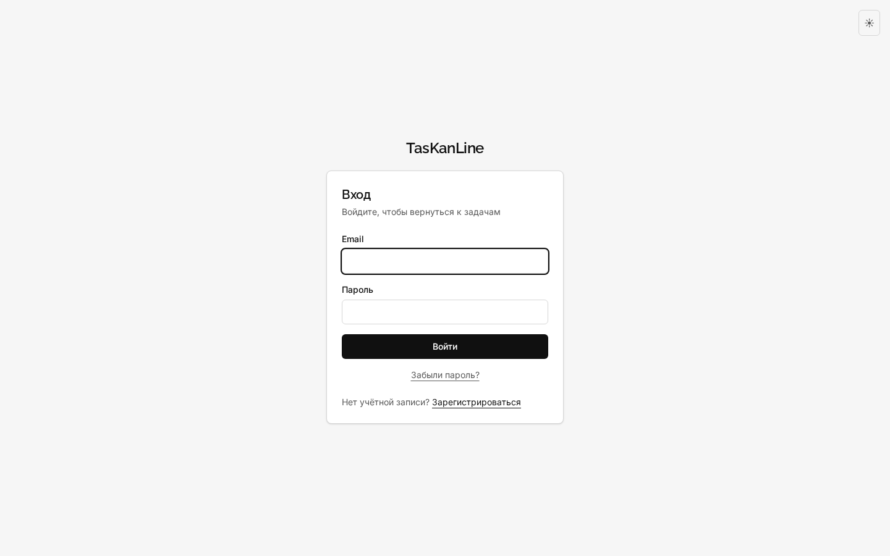

Вход — по email и паролю. «Забыли пароль?» отправляет на почту ссылку для смены пароля.

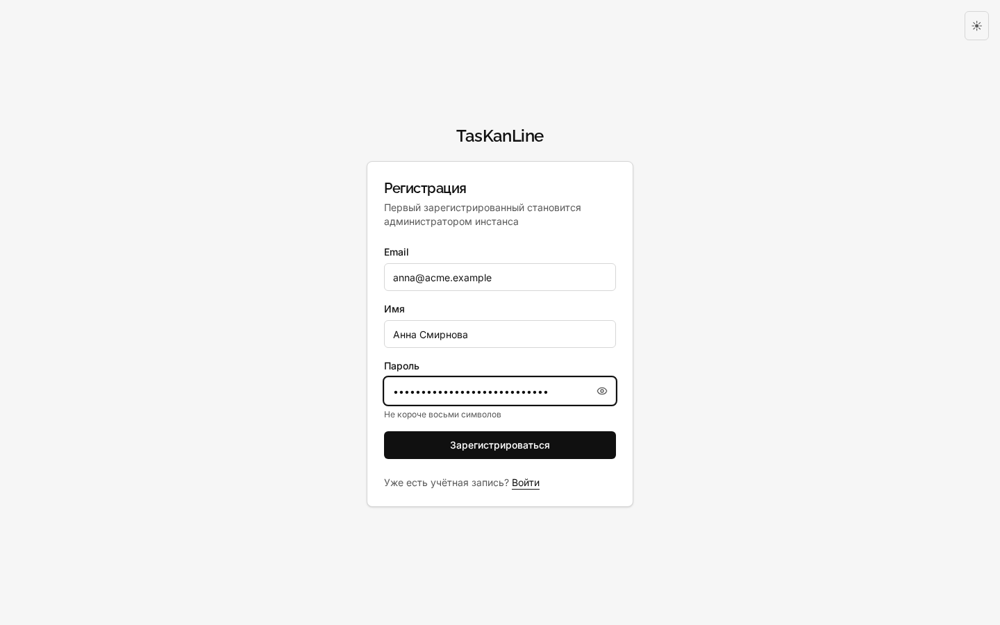

Регистрация открыта не всегда: по умолчанию сервер принимает новых людей **только по
приглашению** (политику меняет администратор инстанса — см. [админ-панель](03-admin.md)).
Тогда учётная запись появляется сама, когда человек принимает приглашение.

### Приглашение по ссылке

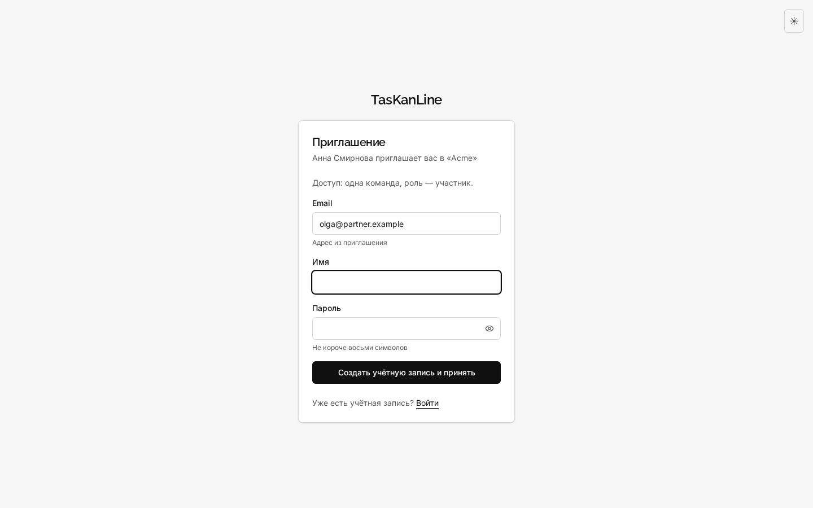

Ссылка из письма открывает страницу с тем, куда и с какой ролью вас позвали. Если учётной записи
ещё нет, достаточно ввести имя и пароль — email берётся из приглашения. Если вы уже вошли под
тем же адресом, кнопка одна: «Принять приглашение».

## Первое пространство

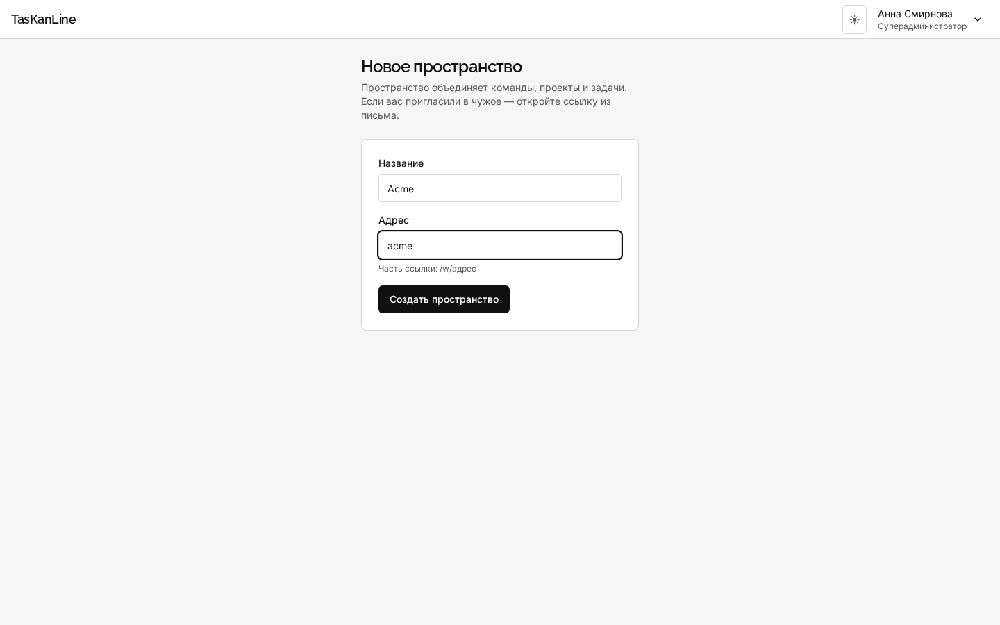

Человек без единого пространства сразу попадает на этот экран. **Название** — как организацию
увидят люди, **адрес** (slug) — часть ссылок: `/w/acme/…`. Адрес — латиница, цифры и дефис;
потом его менять не стоит, иначе сломаются отправленные ссылки.

Создатель становится **владельцем** пространства.

## Как устроен экран

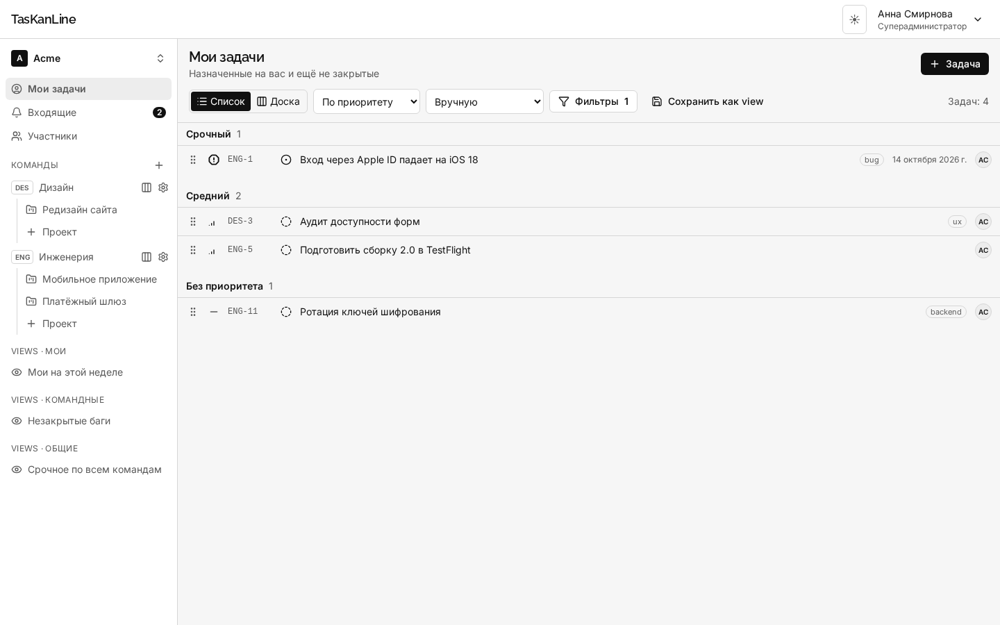

**Сверху** — переключатель темы и меню профиля (профиль, токены доступа, выход).

**Боковое меню**:

- переключатель пространств (`Acme ⌃⌄`) — если вы состоите в нескольких;
- **Мои задачи** — всё, что назначено на вас и ещё не закрыто, по всем командам;
- **Входящие** — уведомления; число — сколько непрочитанных;
- **Участники** — люди пространства и приглашения;
- **Команды** — у каждой иконка доски, шестерёнка настроек и вложенный список проектов;
  `+` у заголовка создаёт команду, «+ Проект» под командой — проект;
- **Views** — сохранённые срезы, по трём разделам: мои, командные, общие.

## Команды и проекты

Новая команда спрашивает **название** и **ключ** — 2–5 латинских заглавных букв (`ENG`). Ключ
становится началом номеров задач: `ENG-1`, `ENG-2`. Новая команда сразу получает набор статусов
`Backlog → Todo → In Progress → Done → Canceled`.

Команда бывает **закрытой**: её не видят участники пространства, которых в неё не позвали.

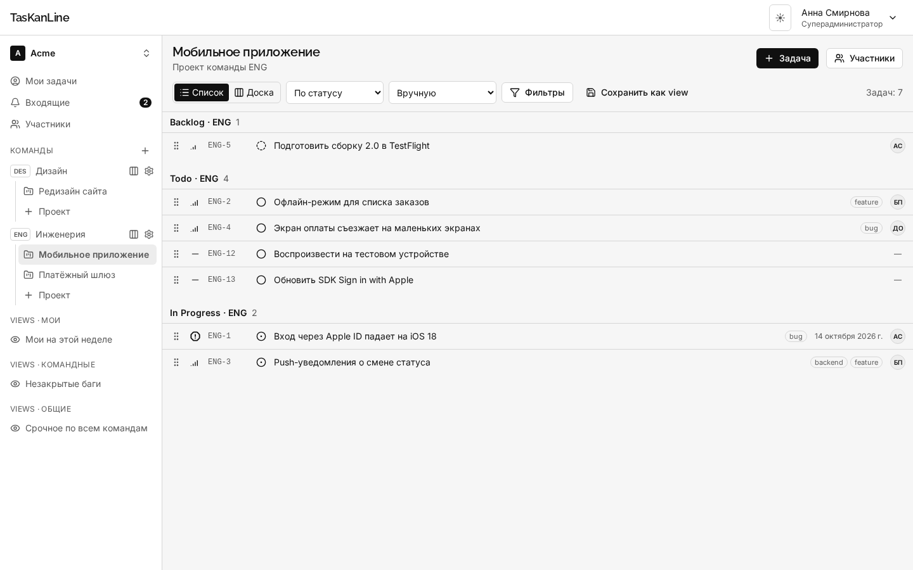

**Проект** — часть работы команды со статусом (запланирован, в работе, на паузе, завершён,
отменён) и сроками. Страница проекта — тот же список задач, только задачи проекта; кнопка
**«Участники»** приглашает людей именно в этот проект.

## Задачи списком и доской

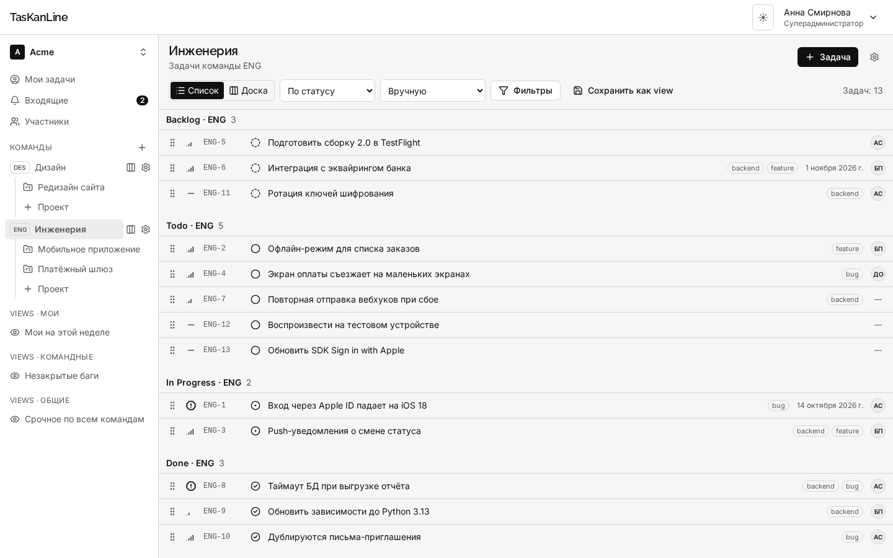

Это главный экран работы. Строка задачи: ручка для перетаскивания `⠿`, значок приоритета, ключ,
значок статуса, название, метки, срок и инициалы исполнителя.

Панель над списком:

| Элемент | Что делает |
|---|---|
| **Список / Доска** | вид среза |
| **По статусу** | группировка: статус, исполнитель, приоритет, проект, метка, срок или без групп |
| **Вручную** | сортировка: ручной порядок, приоритет, срок, создание, изменение, название |
| **Фильтры** | конструктор условий (ниже) |
| **Сохранить как view** | сохранить текущий срез и открывать его из бокового меню |
| **Задач: 13** | сколько задач в срезе |

На **доске** колонки — те же группы. Карточку переносят за ручку `⠿` мышью или с клавиатуры:
`Tab` до ручки, `Пробел` — взять, стрелки — переместить, `Пробел` — положить, `Esc` — отменить.
При группировке по статусу перенос между колонками меняет статус задачи. Перенос внутри
колонки меняет ручной порядок — он общий для всей команды и работает при сортировке «Вручную».
При других группировках и сортировках карточки не перетаскиваются: поля меняют в карточке задачи.

Всё, что вы настроили — вид, группировка, сортировка, фильтры, — записывается в адрес страницы.
Ссылку на срез можно переслать коллеге, и он увидит то же самое (в пределах своих прав).

### Значки

| Значок | Значение |
|---|---|
| пунктирный круг | статус типа `backlog` |
| пустой круг | не начата (`unstarted`) |
| круг с точкой | в работе (`started`) |
| круг с галочкой | завершена |
| круг с крестиком | отменена |
| `!` в круге | приоритет «срочный» |
| три, две, одна полоски | высокий, средний, низкий |
| `—` | без приоритета (в колонке исполнителя — не назначена) |

Палитра интерфейса чёрно-белая: состояние показывается формой и насыщенностью, а не цветом.

## Создание задачи

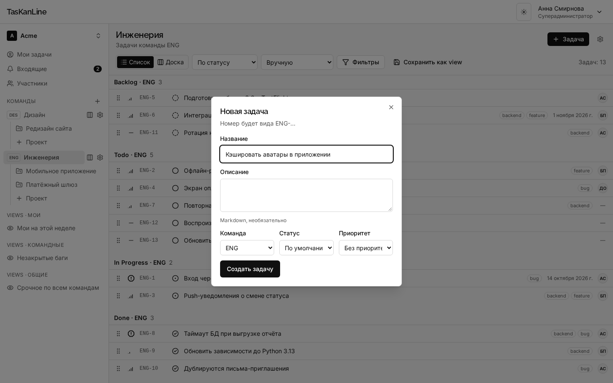

Кнопка **«+ Задача»** или клавиша `c` открывают окно. Обязательно только название; `Enter` в
нём создаёт задачу и открывает её карточку. Команда и проект подставляются из текущей страницы,
статус — из статуса команды «по умолчанию» (`Todo`).

## Карточка задачи

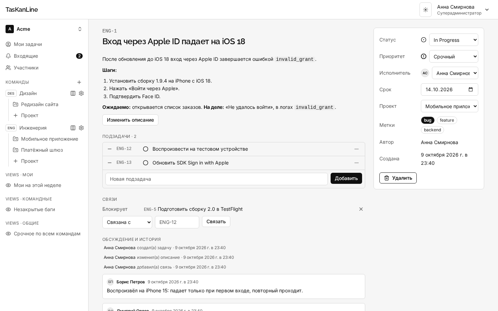

Слева — содержимое, справа — поля.

- **Название** правится прямо в заголовке.
- **Описание** — Markdown: списки, `код`, **жирный**, ссылки. «Изменить описание» открывает
  редактор.
- **Подзадачи** — у задачи могут быть дочерние, они получают свои ключи (`ENG-12`, `ENG-13`) и
  живут как обычные задачи. Поле «Новая подзадача» + «Добавить».
- **Связи** — «блокирует», «заблокирована», «связана с», «дублирует». Выберите тип, введите ключ
  другой задачи, «Связать». Задача, которую блокирует незакрытая, считается заблокированной —
  по этому признаку можно фильтровать.
- **Обсуждение и история** — комментарии вперемешку с событиями: кто создал задачу, сменил
  статус, исполнителя, описание, добавил связь. История пишется сама и не редактируется.
- Справа: **статус, приоритет, исполнитель, срок, проект, метки**. Каждое поле сохраняется сразу,
  отдельной кнопки нет.
- **Удалить** — мягкое удаление: задача пропадает из списков, но лид команды или администратор
  пространства может её восстановить (`tkl task restore ENG-1`).

Ссылка на задачу — `/w/acme/task/ENG-1`: по ключу, а не по внутреннему id.

## Фильтры и views

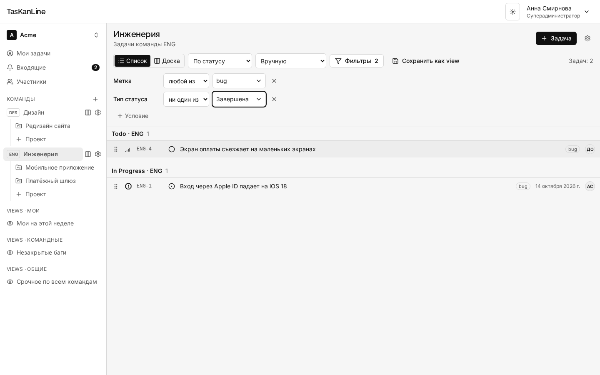

**«Фильтры» → «+ Условие»** добавляет строку: поле, оператор, значения. Условия соединяются
через «И», значения внутри одного условия — через «ИЛИ». Поля: команда, проект, статус, тип
статуса, исполнитель, автор, метка, приоритет, срок, даты создания, изменения и завершения,
название (подстрока), «есть родитель», «заблокирована».

На снимке — незакрытые баги: метка `bug` **и** тип статуса **ни один из** «Завершена».

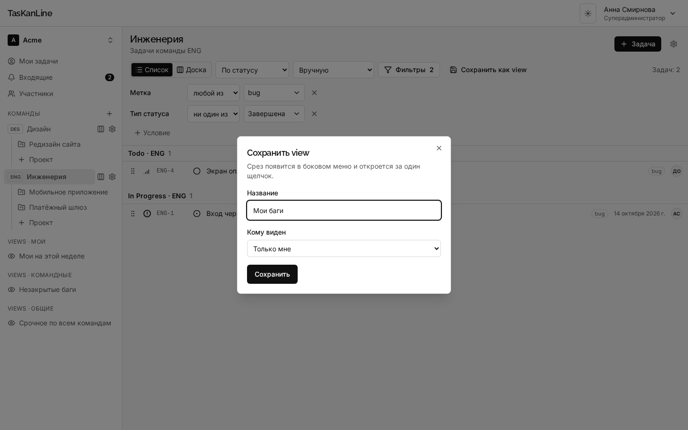

**«Сохранить как view»** превращает срез в именованный view:

| Кому виден | Кто создаёт | Где в меню |
|---|---|---|
| **Только мне** | любой | «Views · мои» |
| **Команде** | участник команды | «Views · командные» у всех её участников |
| **Всему пространству** | администратор пространства | «Views · общие» |

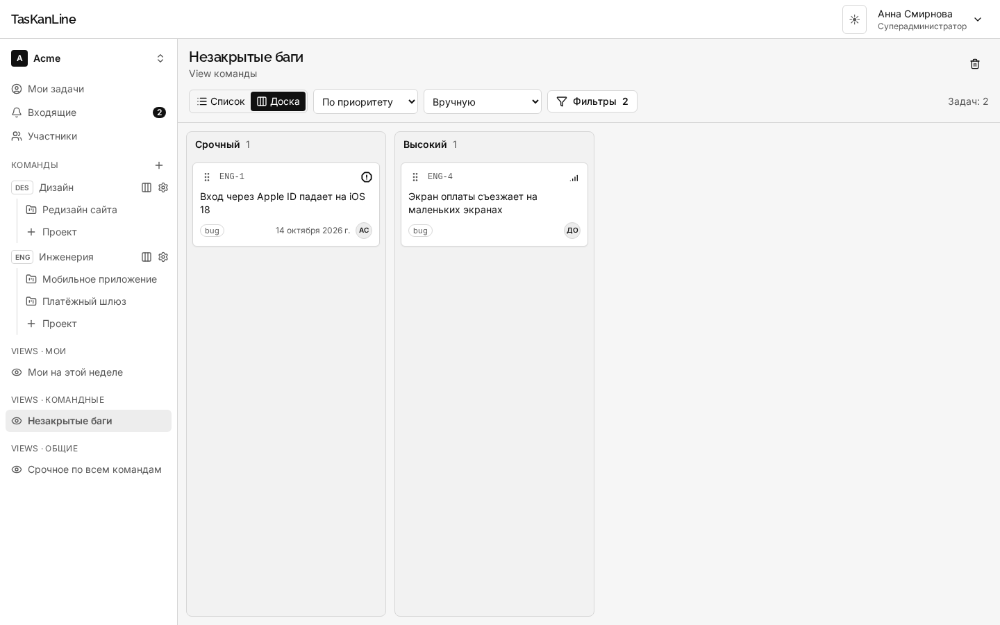

View хранит фильтры, группировку, сортировку и вид. Фильтр «исполнитель — я» (`@me`) у каждого
свой: общий view «мои задачи» каждому показывает его собственные. И общий view никогда не
показывает больше, чем человек и так может видеть.

Изменить или удалить view (значок корзины в углу) может его автор; командный — ещё и лид
команды, общий — администратор пространства.

## Входящие

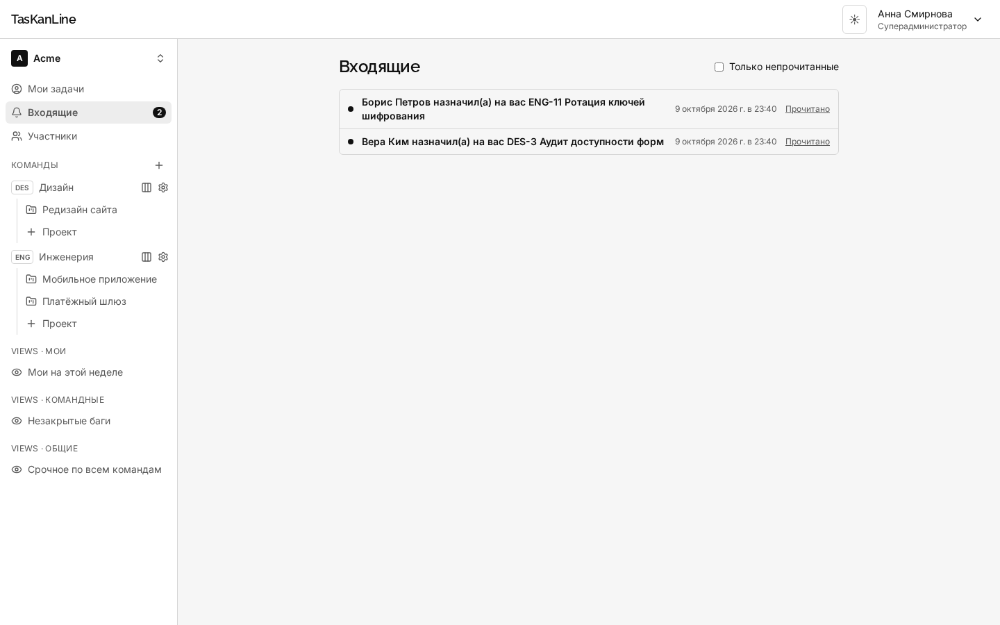

Уведомления приходят, когда кто-то назначил на вас задачу или упомянул вас в комментарии
(`@email`). Точка — непрочитанное; «Прочитано» снимает отметку, щелчок по строке открывает
задачу. Флажок «Только непрочитанные» прячет остальное.

## Участники и приглашения

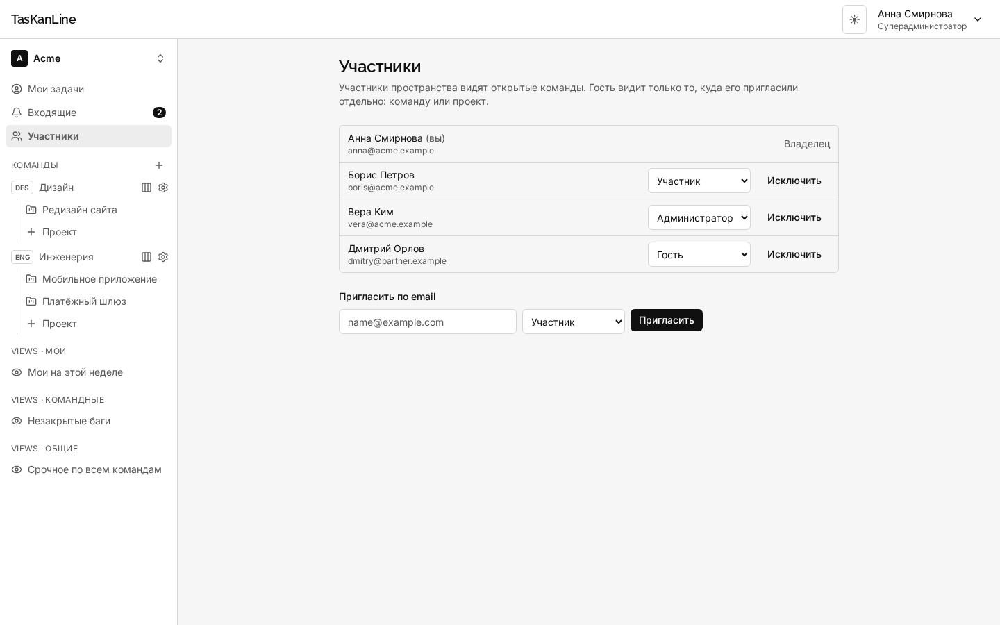

Страница **Участники** — люди пространства и их роли. Владелец и администраторы меняют роли
списком справа и исключают людей; внизу — приглашение по email.

Что значат роли — в [таблице ролей](README.md#роли-внутри-пространства). Коротко:
**участник** видит все открытые команды, **гость** — только то, куда его позвали отдельно. Тот,
кого пригласили в команду или проект, приходит в пространство гостем, и это нормально; своих
сотрудников повысьте до участника.

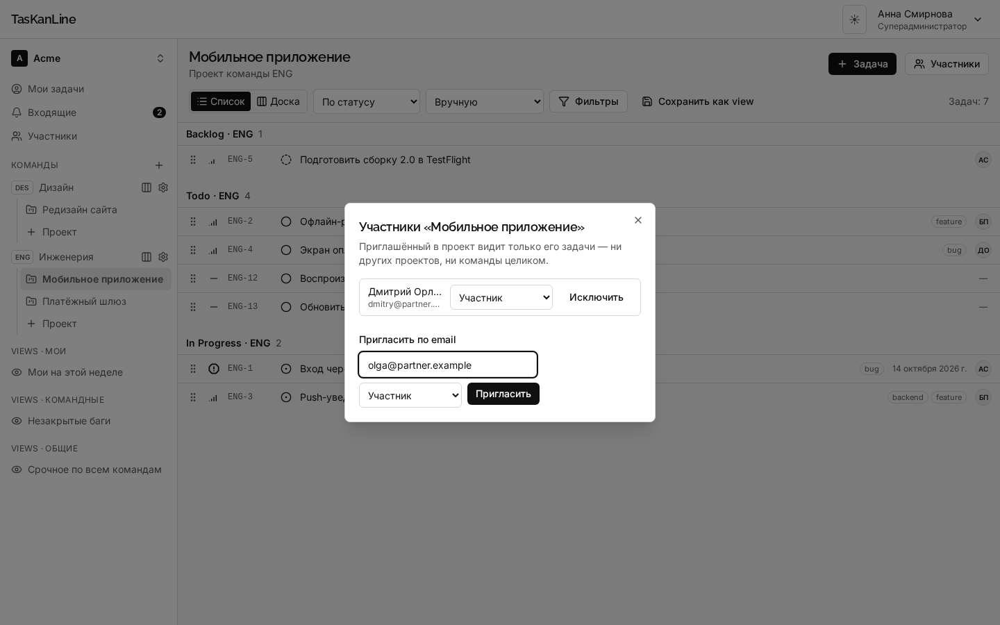

Приглашать можно на трёх уровнях:

- **в пространство** — со страницы «Участники»;
- **в команду** — в настройках команды, раздел «Участники команды»;
- **в проект** — кнопкой «Участники» на странице проекта.

Человек со стороны — подрядчик, заказчик — приглашается **в проект**: он увидит задачи только
этого проекта, а прямая ссылка на любую другую задачу ответит «не найдена».

Приглашение — письмо со ссылкой; срок жизни ссылки задаёт администратор инстанса (по умолчанию
7 дней).

## Настройки команды

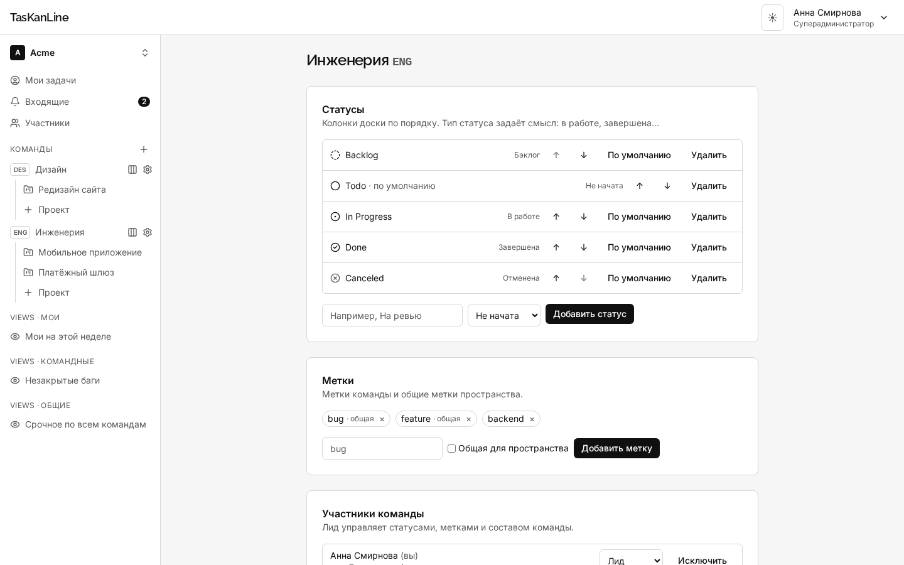

Шестерёнка у команды в меню. Доступны лиду команды и администраторам пространства.

- **Статусы** — колонки доски по порядку. У каждого — тип (бэклог, не начата, в работе,
  завершена, отменена), стрелки порядка, «По умолчанию» — в какой статус попадают новые задачи.
  Добавить свой: название + тип + «Добавить статус», например «На ревью» с типом «в работе».
- **Метки** — метки команды и общие метки пространства (отмечены «· общая»). Флажок «Общая для
  пространства» создаёт метку, доступную всем командам.
- **Участники команды** — состав и роли (лид, участник), приглашение в команду.

## Профиль и оформление

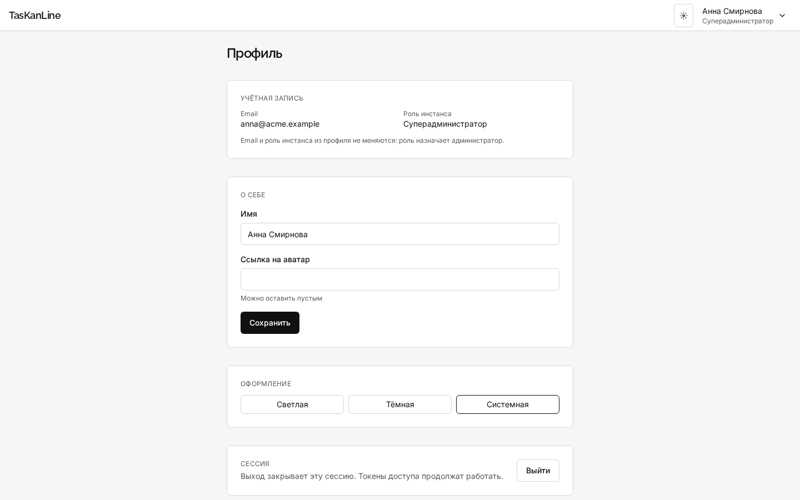

Меню с вашим именем справа сверху → **Профиль**: имя, ссылка на аватар, тема оформления
(светлая, тёмная или как в системе) и выход. Email и роль инстанса здесь не меняются — роль
назначает администратор инстанса.

Тема переключается и кнопкой ☀/☾ в шапке.

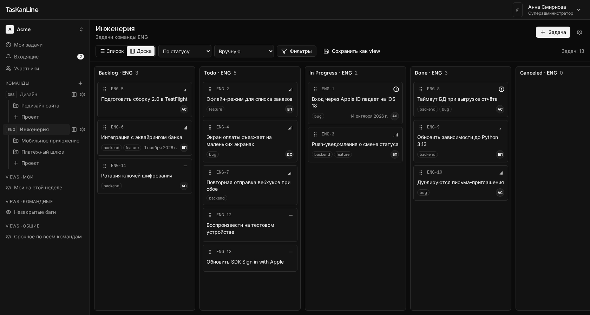

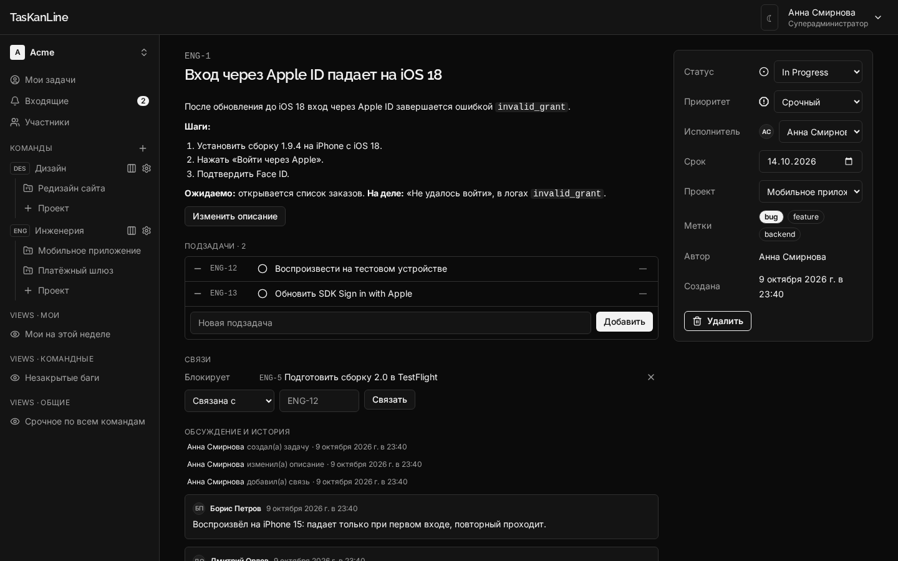

## Токены доступа

Меню профиля → **Токены доступа**. Токен — это пароль для CLI и агентов: он действует от вашего
имени, но только в пределах выбранной области.

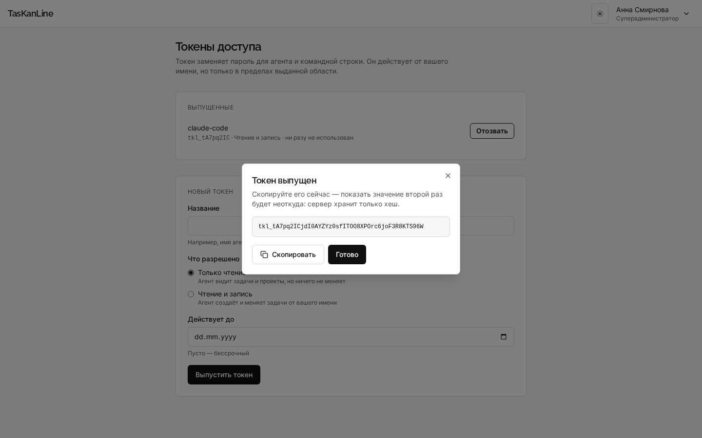

1. **Название** — чтобы потом узнать токен в списке: имя агента или машины (`claude-code`,
   `ci-runner`).
2. **Что разрешено**: **только чтение** — агент видит задачи, но ничего не меняет; **чтение и
   запись** — создаёт и меняет задачи от вашего имени.
3. **Действует до** — пусто означает бессрочный.

**Полное значение показывается один раз**, сразу после выпуска: скопируйте его. На сервере
хранится только хеш, и потерянный токен не восстановить — выпускается новый.

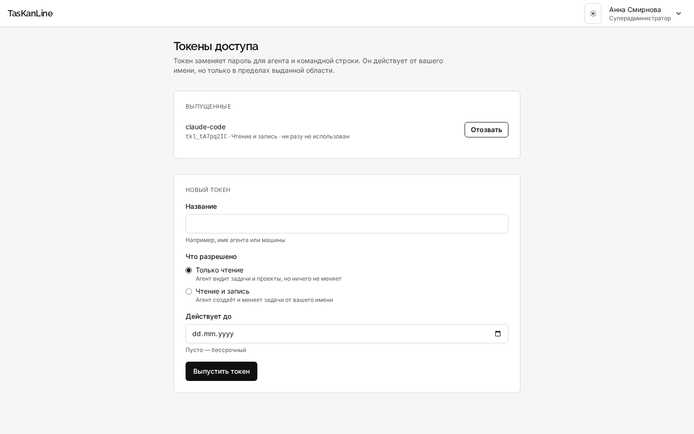

В списке видны префикс, права и когда токен последний раз использовался. **«Отозвать»**
выключает токен немедленно. Выход из профиля токены не отзывает.

Что делать с токеном дальше — в разделах [CLI](04-cli.md) и [MCP](05-mcp.md).

## Горячие клавиши

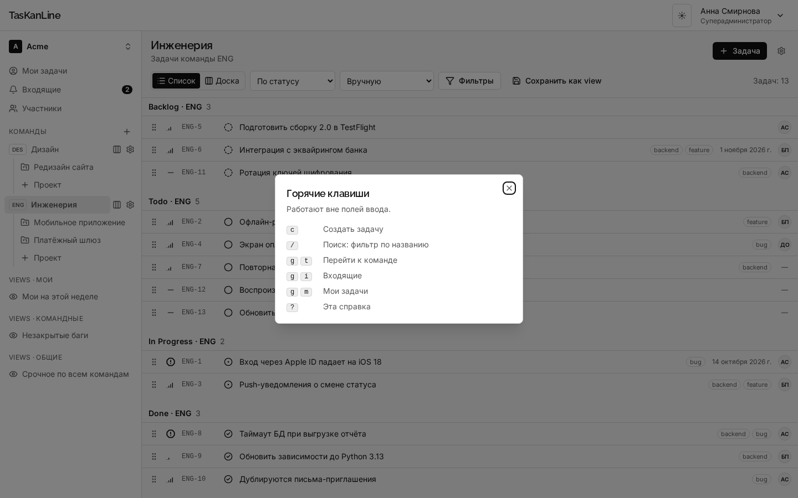

Работают, когда курсор не в поле ввода и не открыто другое окно.

| Клавиша | Действие |
|---|---|
| `c` | создать задачу |
| `/` | поиск: фильтр по названию в текущем срезе |
| `g` затем `t` | перейти к команде |
| `g` затем `i` | входящие |
| `g` затем `m` | мои задачи |
| `?` | эта справка |
