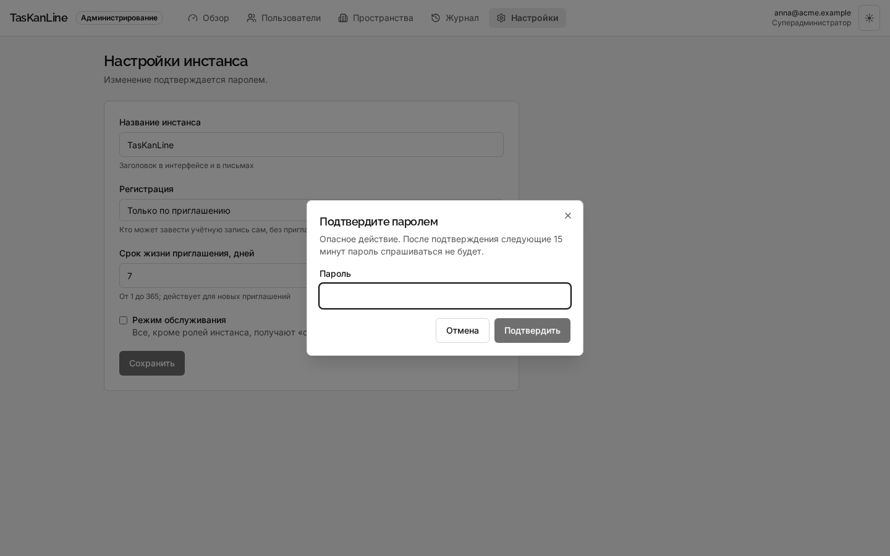
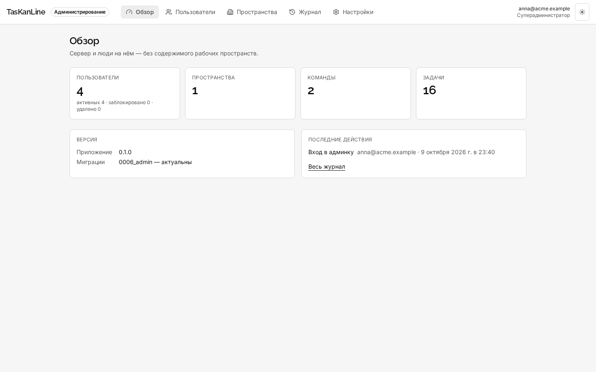
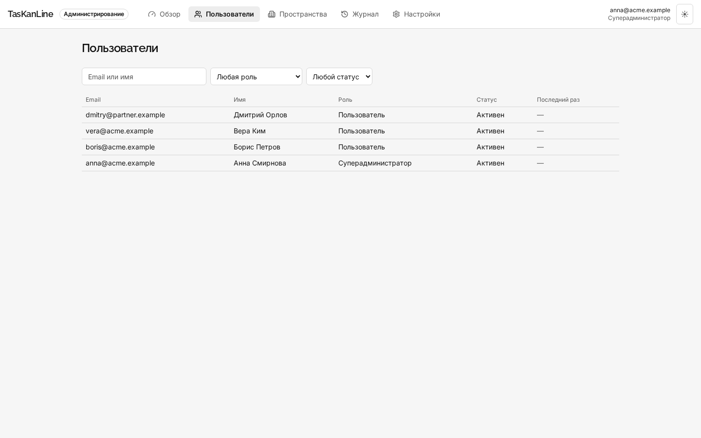
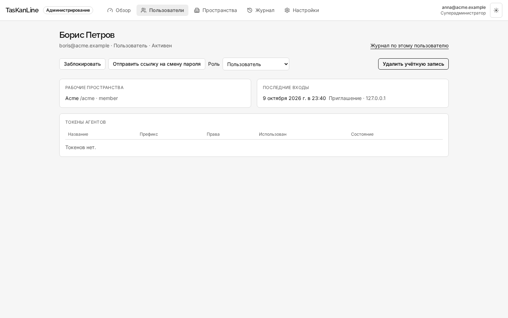
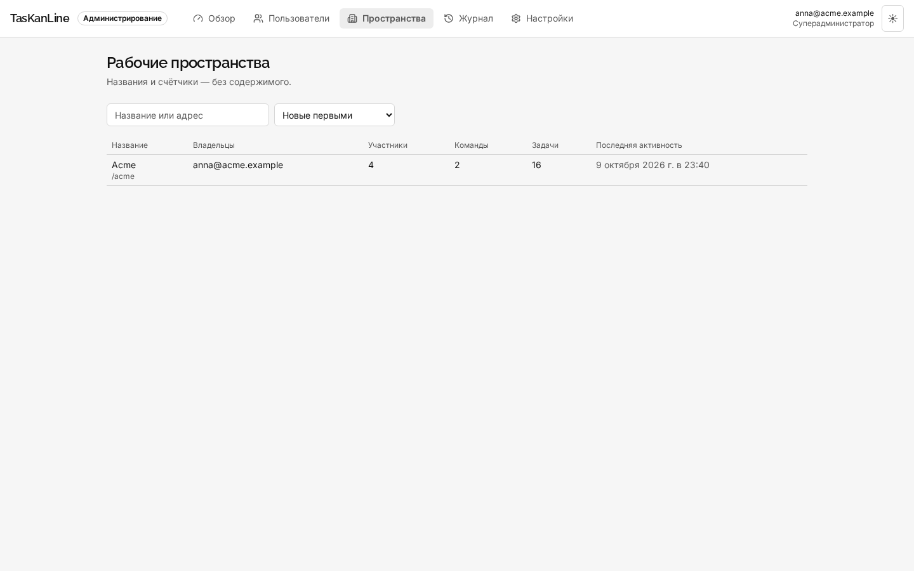
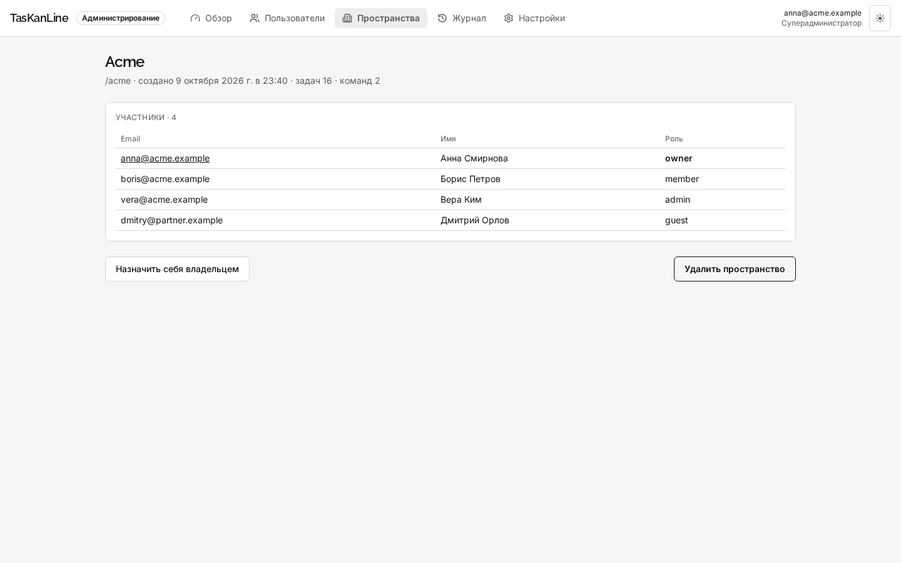
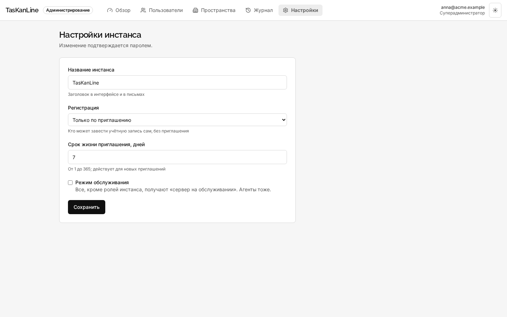
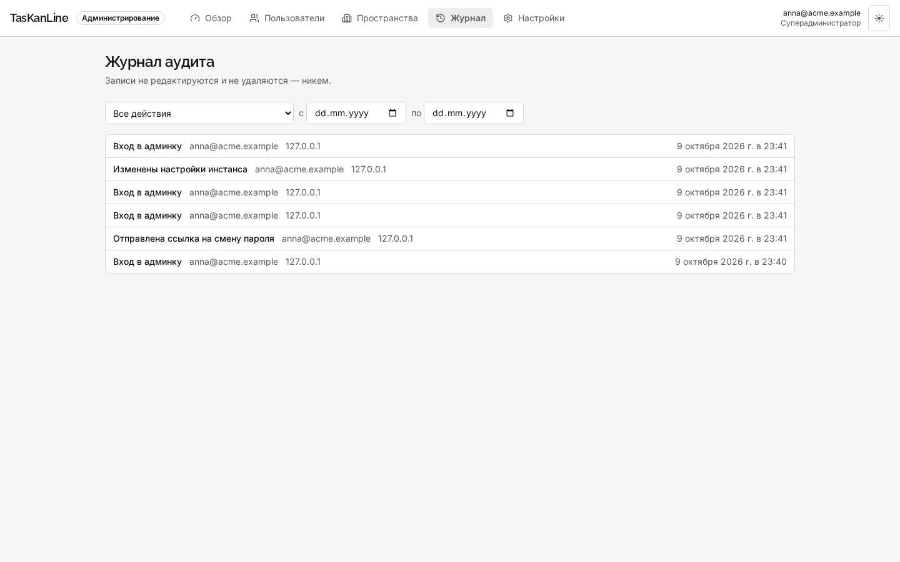

# 3. Админ-панель

Админ-панель управляет **сервером**, а не задачами: кто на нём зарегистрирован, какие есть
рабочие пространства, кто может регистрироваться, что делали администраторы. Это отдельное
приложение: локально http://localhost:5175, в Docker http://localhost:8081.

Своего входа у панели нет — она пользуется сессией веб-клиента. Войдите в клиент, затем откройте
панель в той же вкладке браузера.

## Главный принцип: без содержимого

Панель **не показывает ни одной задачи**: ни названий, ни описаний, ни комментариев — только
количества, названия пространств и людей. Администратор сервера не обязан быть участником
пространства и не получает доступа к его работе. Если ему нужно увидеть задачи — его
приглашают в пространство, как любого.

## Кто сюда попадает: роли инстанса

| Роль | Что может |
|---|---|
| **Поддержка** (`support`) | смотреть: обзор, люди, пространства, журнал, настройки |
| **Администратор** (`admin`) | всё, что поддержка, плюс блокировать и разблокировать людей, отправлять ссылку на смену пароля, отзывать их токены, удалять пространства |
| **Суперадминистратор** (`superadmin`) | всё, плюс менять роли инстанса, удалять учётные записи, назначать себя владельцем пространства, менять настройки сервера |
| **Пользователь** (`user`) | в панель не попадает вовсе |

Обычному пользователю панель отвечает «Страница не найдена» — так же, как чужая задача в
клиенте. Токен агента (PAT) панель не принимает ни при какой роли: `403 session_required`.
Управлять сервером может только человек в браузере.

Первый зарегистрировавшийся на сервере становится суперадминистратором. Действовать над
человеком с ролью выше своей нельзя, а последнего действующего суперадминистратора нельзя ни
понизить, ни заблокировать, ни удалить.

## Подтверждение паролем

Опасные действия — смена роли, удаление пользователя или пространства, передача владения,
изменение настроек — требуют ввести пароль ещё раз. После подтверждения 15 минут пароль не
спрашивается. Три неверных пароля подряд закрывают сессию.

## Обзор

Счётчики сервера: пользователи (активные, заблокированные, удалённые), пространства, команды,
задачи. Ниже — версия приложения и состояние миграций базы («актуальны» или какие не
применены) и последние действия из журнала.

## Пользователи

Поиск по email и имени, фильтры по роли инстанса и статусу, время последнего входа.

Карточка человека:

- **Заблокировать** — немедленно: все его сессии и **все токены агентов** перестают работать,
  войти он больше не может. «Разблокировать» возвращает вход, но токены придётся выпустить
  заново. Подходит для уволившегося сотрудника.
- **Отправить ссылку на смену пароля** — письмо со ссылкой на адрес пользователя. Пароль
  администратор не видит и не задаёт.
- **Роль** — роль инстанса (только суперадминистратор, с подтверждением паролем).
- **Удалить учётную запись** — это анонимизация: имя становится «Удалённый пользователь»,
  email — заглушкой, войти больше нельзя, а адрес освобождается для новой регистрации. Задачи и
  комментарии остаются на месте. Если человек — единственный владелец какого-то пространства,
  удалить его нельзя: сначала передайте владение.
- **Рабочие пространства** — где он состоит и с какой ролью.
- **Последние входы** — когда, каким способом (пароль, приглашение) и с какого адреса.
- **Токены агентов** — его PAT: название, префикс, права, когда использован. Отдельный токен
  можно отозвать.
- **Журнал по этому пользователю** — все действия администраторов над ним.

## Рабочие пространства

Название и адрес, владельцы, число участников, команд и задач, последняя активность.

Карточка пространства — участники и их роли. Два действия:

- **Назначить себя владельцем** — аварийная передача владения, когда владелец ушёл и пространство
  осталось без хозяина. Только суперадминистратор, с подтверждением паролем, и всегда в журнал.
- **Удалить пространство** — вместе со всеми командами, проектами и задачами.

## Настройки инстанса

| Поле | Что значит |
|---|---|
| **Название инстанса** | заголовок в интерфейсе и в письмах |
| **Регистрация** | **только по приглашению** (по умолчанию) — новые люди приходят только по ссылкам; **открытая** — регистрируется кто угодно; **по доменам почты** — только адреса из списка доменов (`acme.example, partner.example`) |
| **Срок жизни приглашения, дней** | от 1 до 365; действует для новых приглашений |
| **Режим обслуживания** | все, кроме ролей инстанса, получают «сервер на обслуживании» — и агенты тоже |

Пустой сервер открыт для первой регистрации, даже если стоит «только по приглашению»: иначе
войти было бы некому.

## Журнал аудита

Каждое действие в панели — вход в неё, блокировка, смена роли, удаление, сброс пароля, изменение
настроек — оставляет запись: что сделано, кто, с какого адреса и когда. Фильтры — по типу
действия и периоду.

Записи **не редактируются и не удаляются никем**, в том числе суперадминистратором. Неудачное
действие (например, отказ из-за нехватки прав) записи не оставляет.

## Типовые задачи

**Сотрудник уволился.** Пользователи → найти → «Заблокировать». Сессии и токены его агентов
отключатся сразу. Если он владел пространством — Пространства → карточка → «Назначить себя
владельцем». Передать владение дальше, нужному человеку, новый владелец может запросом
`POST /api/v1/workspaces/{id}/transfer-ownership` с `{"user_id": "…"}` — в веб-клиенте отдельной
кнопки для этого пока нет.

**Закрыть регистрацию.** Настройки → Регистрация: «Только по приглашению» → «Сохранить» →
пароль.

**Пустить всех с корпоративной почты.** Настройки → Регистрация: «По доменам почты» → список
доменов через запятую.

**Человек забыл пароль.** Он сам может нажать «Забыли пароль?» на экране входа; или Пользователи
→ карточка → «Отправить ссылку на смену пароля».

**Потерян доступ к единственному суперадминистратору.** Из панели это не решить — роль
назначается на сервере: `uv run python -m app.admin grant --email … --role superadmin`
(см. [установку](01-setup.md#если-доступ-потерян)).

## Безопасность развёртывания

В docker-compose панель — отдельный контейнер со своим nginx (`deploy/nginx/admin.conf`). Впишите
туда сети, из которых её разрешено открывать, — например, только VPN офиса. Если клиент и панель
живут на разных поддоменах (`tasks.acme.example` и `admin.acme.example`), сессию между ними
делит `AUTH__COOKIE_DOMAIN=acme.example`.
