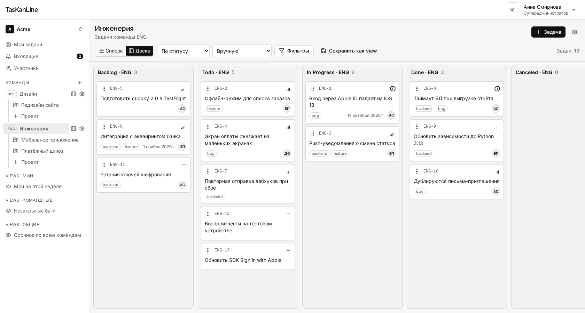

# Руководство пользователя TasKanLine

TasKanLine — трекер задач для небольших команд, в которых часть работы делают ИИ-агенты.
Человек работает в браузере, агент — через CLI `tkl` или MCP-сервер `tkl-mcp`, и оба видят
одни и те же задачи с одними и теми же правами.



## Разделы

| Раздел | Для кого | О чём |
|---|---|---|
| [1. Установка и запуск](01-setup.md) | администратор сервера, разработчик | как поднять проект локально и в Docker, первый вход, восстановление доступа |
| [2. Веб-клиент](02-client.md) | все | пространства, команды, проекты, задачи, доска, views, участники, токены |
| [3. Админ-панель](03-admin.md) | роли инстанса `support`, `admin`, `superadmin` | люди, пространства, политика регистрации, журнал аудита |
| [4. CLI `tkl`](04-cli.md) | разработчики и агенты в терминале | установка, вход по токену, фильтры, справочник команд, коды выхода |
| [5. MCP-сервер `tkl-mcp`](05-mcp.md) | пользователи Claude, ChatGPT и других MCP-клиентов | подключение, режим только чтения, каталог инструментов |

## Словарь

**Инстанс** — один развёрнутый сервер TasKanLine со своей базой. У инстанса есть свои роли
(`superadmin`, `admin`, `support`, `user`) — они про управление сервером, а не про задачи.

**Рабочее пространство (workspace)** — организация: всё остальное живёт внутри него. У каждого
пространства короткий адрес — slug, по нему строятся ссылки: `/w/acme`.

**Команда (team)** — группа людей со своими статусами, метками и нумерацией задач. У команды
ключ из 2–5 латинских заглавных букв, например `ENG`; задачи команды получают ключи `ENG-1`,
`ENG-2`, … Ключ задачи — главный способ сослаться на неё: в браузере, в CLI и в разговоре с
агентом.

**Проект** — часть работы команды с целью и сроками («Мобильное приложение 2.0»). Задача может
лежать в проекте или прямо в команде. В проект можно пригласить человека со стороны, и он
увидит только задачи этого проекта.

**Задача** — название, описание в Markdown, статус, приоритет, исполнитель, срок, метки,
подзадачи, связи, комментарии и история изменений.

**Статус и тип статуса.** Статусы у каждой команды свои (`Backlog`, `Todo`, `In Progress`,
`Done`, `Canceled` — набор по умолчанию), но каждый относится к одному из пяти типов:

| Тип | Смысл |
|---|---|
| `backlog` | когда-нибудь |
| `unstarted` | запланирована, не начата |
| `started` | в работе |
| `completed` | сделана |
| `canceled` | отменена |

Фильтры, отчёты и агенты опираются на тип, а не на название: «открытые задачи» — это
`unstarted` и `started` у любой команды, как бы та ни называла свои колонки.

**Приоритет** — 0 «без приоритета», 1 «срочный», 2 «высокий», 3 «средний», 4 «низкий». В CLI и
MCP — `none`, `urgent`, `high`, `medium`, `low`.

**View** — сохранённый срез задач: фильтры, группировка, сортировка и вид (список или доска).
Бывает личным, командным или общим для пространства.

**Токен доступа (PAT)** — строка `tkl_…`, которой агент или CLI доказывает, что действует от
вашего имени. Права токена — `read` (только чтение) или `read_write`.

## Роли внутри пространства

Права складываются из трёх уровней; действует наибольшая из ролей, которые у человека есть.

| Уровень | Роль | Что может |
|---|---|---|
| Пространство | **Владелец** | всё, включая удаление пространства и передачу владения; владелец один |
| | **Администратор** | создаёт команды, приглашает людей, меняет роли, управляет всеми командами и проектами |
| | **Участник** | видит все открытые команды, создаёт и меняет задачи, создаёт проекты |
| | **Гость** | видит только команды и проекты, куда его пригласили отдельно |
| Команда | **Лид** | управляет статусами, метками и составом команды |
| | **Участник** | работает с задачами команды |
| Проект | **Администратор** | управляет составом проекта, архивирует его |
| | **Участник** | работает с задачами проекта |
| | **Наблюдатель** | только читает |

Чего человек не видит, того для него нет: прямая ссылка на чужую задачу отвечает «не найдена»,
а не «нет доступа», — так нельзя даже узнать, что задача существует.

## Как обновить скриншоты

Все картинки в `images/` сняты Playwright с настоящего приложения на тестовой базе. После
изменений интерфейса их пересобирает одна команда (нужен запущенный PostgreSQL — `make db-up`):

```bash
make docs-screenshots
```

Сценарий — `frontend_client/e2e/docs/screenshots.shots.ts`: он пересоздаёт базу
`taskanline_e2e`, заполняет её примером (пространство Acme, команды ENG и DES, четыре человека,
полтора десятка задач, обсуждения, views) и снимает экраны клиента и админки. Рабочую базу он не
трогает.
